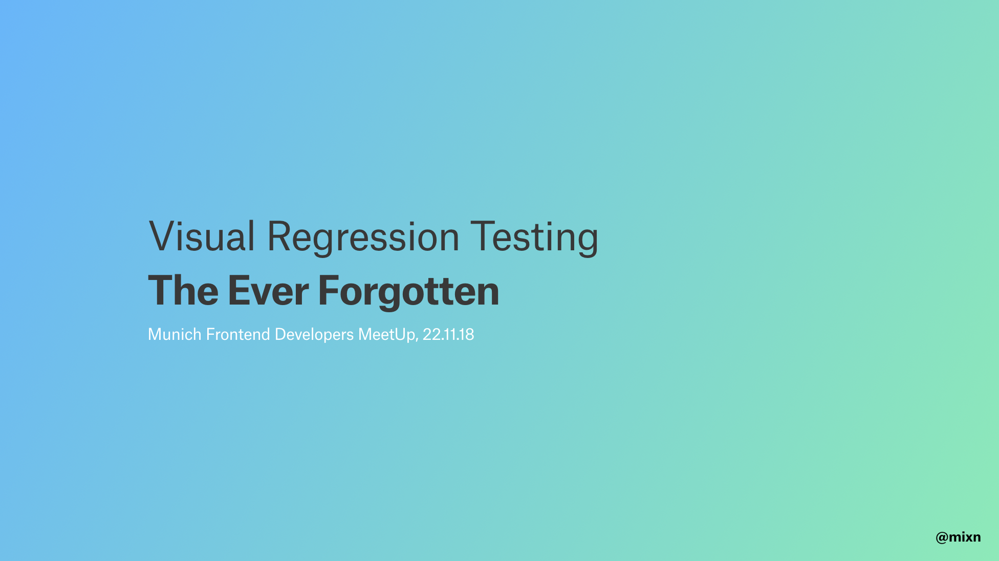

## 🏄‍

A small demo 💻 to complement my “*Visual Regression Testing: Regressions, Obsessions & Dirty Confessions*” talk.

### Tooling

Although the tooling possibilities are almost endless and some setups suit certain scenarios/teams better than others, this demo uses:

- 🐙 [**React Styleguidist**](https://github.com/styleguidist/react-styleguidist) as a baseline
- 🦔 [**Percy**](http://percy.io/) for visual testing
	- [**react-percy**](https://github.com/percy/react-percy) for the actual tests
- ▲ [**now**](https://zeit.co/now) for instant deployments
- 👷‍ [**Travis CI**](https://travis-ci.org/) for CI
